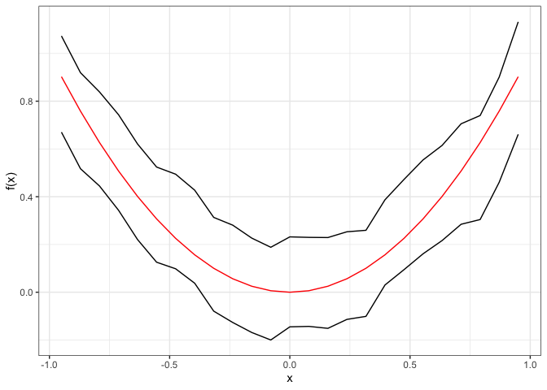

<!-- README.md is generated from README.Rmd. Please edit that file -->

# HTEBand

<!-- badges: start -->
<!-- badges: end -->

The goal of HTEBand is to construct uniform confidence bands for
conditional expectation functions and conditional average treatment
effect functions.

## Installation

You can install the development version from
[GitHub](https://github.com/) with:

``` r
install.packages("remotes") # if not installed
remotes::install_github("koohyun-kwon/HTEBand")
```

## Instruction

For a conditional expectation function, use `NpregBand` command. For a
conditional average treatment effect function, use `CATEBand` command.
See help page of each function for details:

``` r
?HTEBand::NpregBand
?HTEBand::CATEBand
```

## Example

Nonparametric regression via `NpregBand`:

``` r
library(HTEBand)
library(tidyverse)
#> ── Attaching packages ─────────────────────────────────────── tidyverse 1.3.1 ──
#> ✓ ggplot2 3.3.5     ✓ purrr   0.3.4
#> ✓ tibble  3.1.5     ✓ dplyr   1.0.7
#> ✓ tidyr   1.1.4     ✓ stringr 1.4.0
#> ✓ readr   2.0.2     ✓ forcats 0.5.1
#> ── Conflicts ────────────────────────────────────────── tidyverse_conflicts() ──
#> x dplyr::filter() masks stats::filter()
#> x dplyr::lag()    masks stats::lag()
x <- seq(-1, 1, length.out = 500)
y <- x^2 + rnorm(500, 0, 1/4)
cb.res <- NpregBand(y, x, 2, 0.95, "L", n.eval = 25, c.method = "supp",
                    print.t = FALSE)
#> Residual calculation... Done 
#> Optimal bandwidth calculation... Done 
#> CB construction... 
#> Done
cb.res$fx <- (cb.res$eval)^2
ggplot(data = cb.res) + geom_line(aes(x = eval, y = cb.lower)) +
  geom_line(aes(x = eval, y = cb.upper)) + geom_line(aes(x = eval, y = fx), color = "red") +
  theme_bw() + xlab("x") + ylab("f(x)")
```


